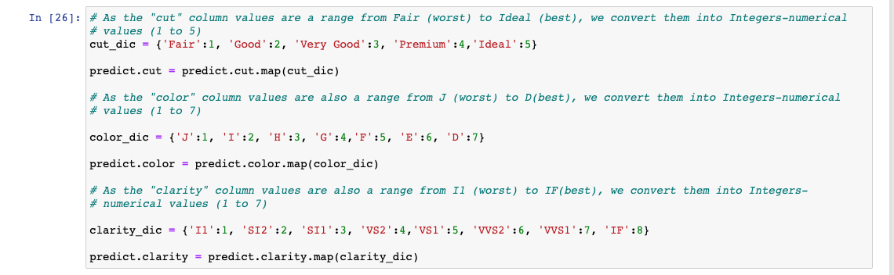
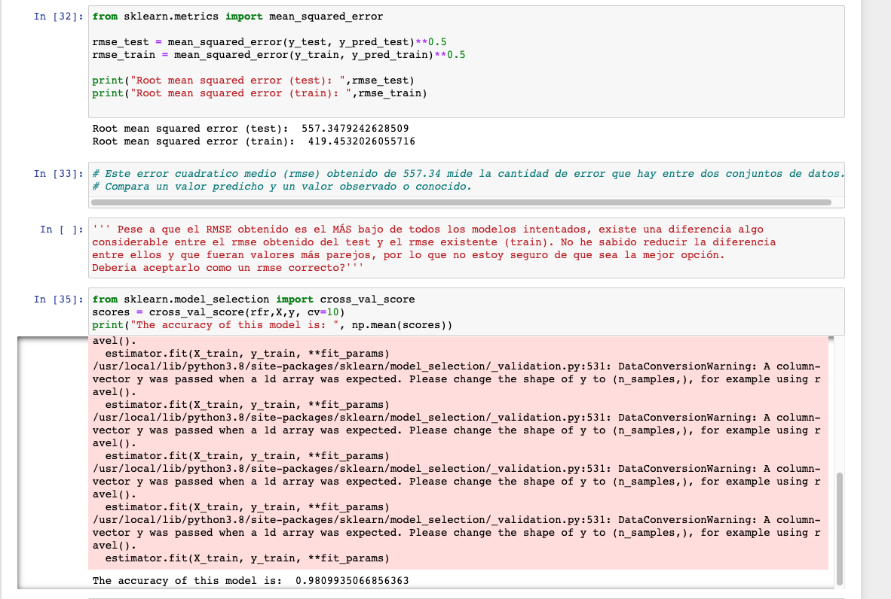

# Week 7 - Project - Kaggle-competition

En este proyecto, teniamos que predecir el precio de un diamante en función de sus características.

Para ello, dividimos el proyecto en dos partes:

- Exploración y Limpieza de datasets:

Partiamos de dos datasets: train.csv y predict.csv.

El primero contenia la columna precios para entrenar el modelo, mientras que el segundo csv no contenía esa columna para realizar la predicción.

En primer lugar, debiamos explorar el dataset "train", estudiar la información que contenía, tipo de columnas (int, float, object), comprobar si existían valores nulos, etc.

Al estudiar el dataset, nos damos cuenta que las columnas "Cut", "Color" y "Clarity" son object type, por lo que debemos pasarlas a enteros. Estas 3 columnas tienen sus valores entre rangos (de peor a mejor), por lo que decidimos darle valores numericos de 1 a 8 para convertirlas en columnas enteras (mediante el uso de diccionario y map).

Una vez convertido todo el dataset a datos numéricos, estudiamos la correlacion entre las diferentes columnas. Nos damos cuenta que las columnas X,Y,Z tienen una alta correlación entre ellas (indican la longitud, anchura y profundidad del diamante), por lo que decidimos eliminar Y,Z para evitar problemas de colinealidad en el dataset. Repetimos todo este proceso de limpieza de datos tambien en el dataset "predict".

- Exploración de Modelos:

Una vez hemos limpiado los datasets, nos disponemos a explorar los modelos con sklearn y elegir los mejores en funcion del RMSE y del R2. Tambien debemos llevar a cabo un cross_value_score para evaluar los resultados y garantizar que son independientes de la particion entre datos de entrenamiento y prueba. 

Tras utilizar los modelos Linear Regression, Decision Tree Regressor, RIDGE, LASSO, Random Forest Regressor y KNeighbors, los que mejores RMSE y R2 obtienen son Decision Tree y Random Forest.

- Problemas que me he encontrado: 

Estas ultimas semanas, se me han hecho un poco complicadas porque eran temas dificiles, algo abstractos, que requerian conocimientos previos de probabilidad, y altos conocimientos de programación (en mi caso) para seguir las clases y no perder el hilo. En cuanto al proyecto, he tenido dudas en el modelo 5-Random Forest Regressor, ya que el RMSE obtenido del X_test difería mucho del X_train, por lo que no estoy seguro si era fiable. He intentado cambiar algunos parametros del modelo RandomForestRegressor pero la diferencia entre RMSE se incrementaba incluso, por lo que tengo la duda de si este modelo es fiable o no (ver la siguiente foto respecto a la duda mencionada en el Modelo 05-Random Forest Regressor).

